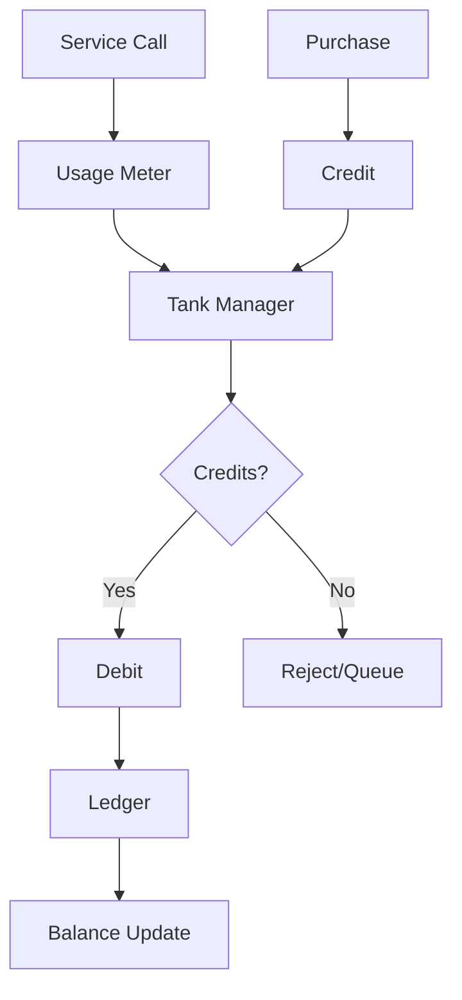

# Economy-Engine Architecture

> Agent context artifact for platform sustainability logic.

## Purpose

Economic modeling service implementing the "Gas Tank" credit-based usage model for platform sustainability and resource metering.

## Technology Stack

- **Language**: Python 3.11+
- **ORM**: SQLAlchemy 2.0+
- **Async**: asyncio + greenlet
- **Validation**: Pydantic v2

## Directory Structure

```
├── src/economy_engine/
│   ├── models/         # SQLAlchemy models
│   ├── meters/         # Usage metering
│   ├── billing/        # Credit calculations
│   ├── tanks/          # Gas tank management
│   └── api/            # Service interfaces
├── tests/
└── migrations/         # Alembic migrations
```

## Component Graph



## Gas Tank Model

```python
class GasTank:
    capacity: int      # Max credits
    balance: int       # Current credits
    refill_rate: int   # Credits per period
    
    def debit(self, amount: int) -> bool
    def credit(self, amount: int) -> None
    def can_afford(self, cost: int) -> bool
```

## Metering Points

All AI operations metered through this engine.
